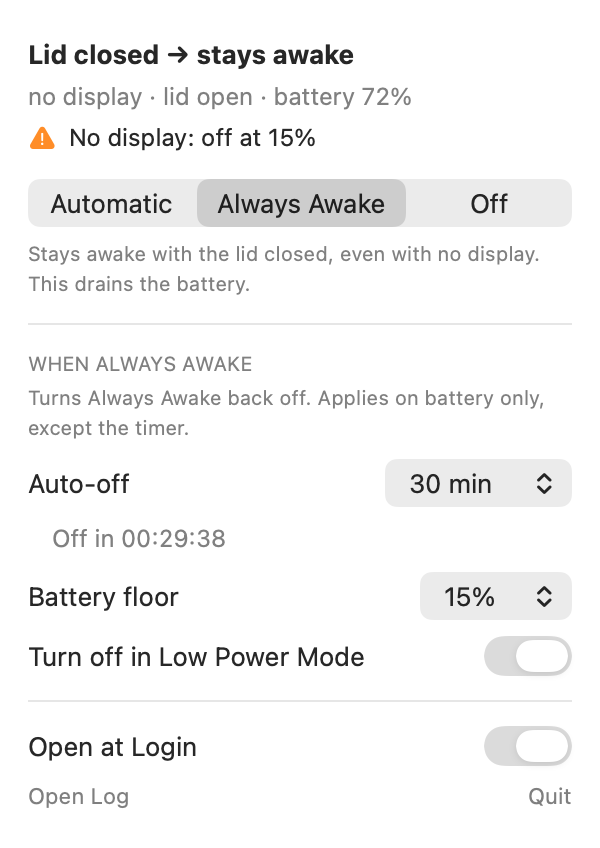

# Clamshell


Use your Mac with the lid closed **on battery power**, with no charger.

macOS supports closed-display ("clamshell") mode only while the Mac is plugged in.
Unplug the charger and the Mac sleeps the moment you shut the lid, even at 100%
battery. Clamshell fixes that, and does it safely. By default the lid-closed
override is on **only while an external display is attached**, so a laptop shut
in a bag still sleeps like it always did.

<p align="center">
  <picture>
    <source media="(prefers-color-scheme: dark)" srcset="docs/images/panel-dark.png">
    
  </picture>
</p>

## Features

- **Works on battery.** Keep working with the lid shut and no charger.
- **Safe by default.** In `auto` mode the Mac stays awake only while a monitor is attached.
- **Ends itself.** Always Awake turns off at a battery floor, after a timer, or
  in Low Power Mode, and then puts a shut Mac to sleep.
- **Screen off, Mac on.** The built-in screen goes dark behind a closed lid.
  Wi-Fi, audio, and running jobs carry on.
- **Fails safe.** If anything is unreadable or unexpected, normal sleep wins.
- **One panel.** See the state, switch modes, and set the cutoffs from the menu bar.
- **No password after install.** Switching modes writes a file in your home folder.
- **Survives reboots.** The watcher runs as a `launchd` system daemon.
- **Small and reversible.** One bash script does the work, and the app is only a
  view onto it. `sudo make uninstall` restores stock behaviour.

## Requirements

- macOS 13 or later.
- **Apple Silicon.** Developed and tested on an M4 running macOS 26. The display
  probe relies on the Apple Silicon display-coprocessor registry layout. Intel
  Macs expose displays differently and would need a different probe.

## Install

```sh
git clone https://github.com/ashahinL/macOS-Clamshell-Toggler.git
cd macOS-Clamshell-Toggler

make                    # build the menu bar app
sudo make install       # install the CLI, the watcher, and the app
```

The installer prints the resulting state and tells you whether the flag took
effect. Then start the menu bar app:

```sh
open /Applications/Clamshell.app
```

To start the app at login, turn on **Open at Login** in the panel. The app
registers with `SMAppService`, so the entry appears under **System Settings →
Login Items**. macOS may ask you to approve it there the first time. If macOS
refuses the registration for a locally built app, Clamshell writes a LaunchAgent
at `~/Library/LaunchAgents/local.clamshell.menubar.plist` instead.

## Use it

### The panel

Click the menu bar icon to open the panel. It shows the current state, the mode
switch, and the cutoff settings. To close it, click outside it, press Esc, or
click the icon again.

The icon is a laptop. Its screen shows what closing the lid will do:

| Icon | Meaning |
|---|---|
|  | Closing the lid puts the Mac to sleep. |
|  | Closing the lid keeps the Mac awake. |
|  | Always Awake is running on battery. Hover over the icon to see which cutoffs will turn it off. |
|  | The watcher is not running, or the CLI is not installed. |

### Pick a mode

| Mode | Display attached | No display | Use it for |
|---|---|---|---|
| `auto` *(default)* | stays awake | **sleeps** | Everyday desk use |
| `on` (Always Awake) | stays awake | stays awake, screen off, until a cutoff | Headless jobs, such as a long build or download with the lid shut |
| `off` | sleeps | sleeps | Stock macOS behaviour |

> [!WARNING]
> `on` keeps the Mac awake with no display attached. Clamshell turns the
> built-in screen off once the lid has been shut for a few seconds, but the Mac
> itself keeps running. In a closed bag, that drains the battery and makes heat.
> Set a [cutoff](#set-a-cutoff) so it turns itself off, or switch back to
> `auto` when you are done.

### Set a cutoff

A cutoff turns Always Awake (`on`) off by itself. Cutoffs apply only while the
mode is `on`.

| Cutoff | Default | Command | When it fires |
|---|---|---|---|
| Battery floor | 15% | `clamshell floor [N\|off]` | On battery, at or below N% on two polls in a row (about 10 seconds). N is 5 to 50. It also fires when the power source cannot be read. A plugged-in Mac never trips it. |
| Auto-off timer | off | `clamshell timer [off\|1h\|2h\|MIN]` | This long after `on` is set. MIN is 1 to 1440 minutes. It fires on AC too. |
| Low Power Mode | off | `clamshell lpm [on\|off]` | On battery, with Low Power Mode on for two polls in a row. Switching to `on` while Low Power Mode is already on skips this cutoff until Low Power Mode turns off. |

When a cutoff fires, Clamshell sets the mode to `off` and clears the sleep
flag, and the app shows a notification. If the lid is shut and no monitor is
attached, Clamshell then puts the Mac to sleep. If the lid is open or a monitor
is attached, it leaves the Mac awake. Plugging in afterwards does not turn `on`
back on.

The root watcher enforces the timer, so quitting the app or rebooting does not
cancel it. When the timer fires, it also sets the timer to `off`, so the next
`on` does not start a new countdown.

### Use the command line

The CLI does everything the panel does. The screen setting is CLI-only.

```sh
clamshell            # status
clamshell auto       # awake with the lid closed, only while a display is attached
clamshell on         # awake with the lid closed, display or not
clamshell off        # stock macOS behaviour
clamshell screen on  # keep the built-in screen lit behind a closed lid
clamshell floor 20   # turn off on battery at 20% or lower
clamshell timer 2h   # turn off two hours after switching on
clamshell lpm on     # turn off while Low Power Mode is on
clamshell log        # recent state changes
clamshell json       # machine-readable status
```

```
$ clamshell
clamshell 1.3.0

  mode                on
  external displays   0
  lid                 open
  power               Battery Power
  battery             65%
  battery floor       15%
  auto-off timer      off
  low power mode      off
  sleep disabled      1
  screen when closed  off
  built-in screen     on
  watcher             running (pid 28965)
  mode file           /Users/you/.config/clamshell/mode

→ Closing the lid keeps this Mac awake.
```

Switching modes never asks for a password. The mode lives in
`~/.config/clamshell/mode`, which you own, and the root watcher reads it.

## How it works

### One flag decides

macOS has an undocumented power-management flag, `disablesleep`. It decides
whether closing the lid sleeps the Mac:

```
external display attached?
        │
        ├── yes ──►  pmset -b disablesleep 1   ──►  lid closed = stays awake
        │
        └── no  ──►  pmset -b disablesleep 0   ──►  lid closed = sleeps (normal)
```

A small root daemon flips the flag whenever the state changes. The `-b` does
not limit the change to battery power. `SleepDisabled` is one system-wide flag,
so it reads `1` on AC too, and `on` keeps an AC Mac awake with the lid shut. On
AC, `auto` changes nothing in practice. It sets the flag only while a display is
attached, and macOS already keeps an AC Mac awake in that case.

The daemon polls its two inputs at different rates:

- **The mode, every second.** You may close the lid right after switching
  modes. A stale flag would make the switch look broken.
- **The displays, every five seconds.** The probe costs about 23 ms, and
  nothing races it.

### The built-in screen turns off

Blocking sleep leaves one problem: macOS never tells the built-in screen to go
dark. Measured on an M4 Air with the lid shut and no monitor attached, the
built-in screen stayed lit for all 100 samples over 50 seconds. That is heat
and battery spent lighting the inside of a closed laptop.

So once the lid has been shut for a couple of polls with no external display,
the daemon runs `pmset displaysleepnow`. That sleeps the display only. Wi-Fi,
audio, downloads, and running jobs carry on, and opening the lid wakes the
screen as usual.

The daemon turns the screen off only when all of these are true:

- Clamshell is what keeps the Mac awake.
- **Zero** external displays are attached. `displaysleepnow` would also turn
  off a monitor, which is the screen you are looking at.
- The lid has read closed on consecutive polls, so one bad sample cannot blank
  a screen you are using.

In practice, that means `on` mode with no monitor. With a monitor attached,
macOS turns the built-in screen off itself. In `auto` mode with no monitor, the
Mac sleeps.

To keep the built-in screen lit behind a closed lid, run `clamshell screen on`.

### Detecting an external display

The daemon runs with no GUI session, so the CoreGraphics display APIs are not
available. Instead it counts IOKit registry nodes that carry a `SinkDeviceOUI`
key:

```sh
ioreg -r -k SinkDeviceOUI -d1 -w0 | awk '/^\+-o /{n++} END{print n+0}'
```

That key holds the manufacturer ID from the monitor's EDID, so it exists only
when a display is physically connected over DisplayPort or HDMI. The built-in
screen never publishes it.

## Troubleshooting

**Switching to `off` with the lid already closed does not sleep the Mac.**
This is expected. macOS decides whether to sleep at the moment the lid closes,
and clearing the flag afterwards does not trigger that decision again. Open and
close the lid, and the Mac sleeps. Cutoffs are the exception: when one fires
with the lid shut and no monitor attached, the watcher runs `pmset sleepnow`.

**The screen stays lit behind a closed lid.** Clamshell turns the screen off
only when no external display is attached. Check that `clamshell screen` reads
`off`, and look for a `display asleep` line in `clamshell log`.

**A mode switch takes a moment.** It takes about a second. If you close the lid
right after switching, the watcher can still apply the old mode.

**The flag does not flip.** Check that the watcher is running, and read its
logs:

```sh
clamshell status
clamshell log
cat /var/log/clamshell.err
```

Every install empties `clamshell.err`, so anything in it happened under the
version you are running. The previous contents are kept at
`/var/log/clamshell.err.prev`.

`clamshell status` reads `built-in screen` from the built-in framebuffer's
`IOMFBBrightnessLevel`. `AppleARMBacklight`'s `BrightnessMicroAmps` is not a
usable indicator. It reports the brightness setting and reads the same whether
the screen is on or off.

**`clamshell status` says the watcher is not running.** Run `sudo make install`
again, or load the watcher by hand:

```sh
sudo launchctl bootstrap system /Library/LaunchDaemons/local.clamshell.plist
```

**`external displays` reads 0 with a monitor plugged in.** The probe may not
match your hardware. Open an issue and include the output of:

```sh
ioreg -r -k SinkDeviceOUI -d1 -w0 | head -40
```

**The menu bar icon is missing.** The app has no Dock icon. Check that it is
running with `pgrep -fl Clamshell`. If it is, the menu bar may be full. Hidden
items are common on notched displays.

## Uninstall

```sh
sudo make uninstall
```

Without the repo, run the copy the installer left behind:

```sh
sudo clamshell-uninstall
```

Both unload the daemon, remove the installed files, and reset `disablesleep`
to `0`.

## Develop

### Run the tests

```sh
make test       # the CLI and the watcher
make preview    # draw the panel to build/preview/*.png, light and dark
```

The suite stubs `ioreg`, `pmset`, and `sudo`, so it covers every state without
unplugging a monitor. It checks:

- **Mode to flag.** Every combination of mode and attached displays.
- **Fail-safe.** A missing mode file, a garbage one, and a failing `ioreg` all
  resolve to "let it sleep".
- **Daemon environment.** The watcher starts under `env -i`. This guards
  against the unset `$HOME` that once left it crash-looping.
- **The built-in screen.** It turns off only with the lid shut, no monitor
  attached, and the Mac held awake.
- **Cutoffs.** Battery floor, timer, and Low Power Mode, including that every
  write the root watcher makes runs as the folder's owner.
- **JSON shape.** `clamshell json` parses and has every field.
- **Installer.** The error log is rotated between `bootout` and `bootstrap`.
- **Versions.** The app bundle and the CLI agree.
- **Syntax and shellcheck.** Every script parses, and `shellcheck` runs at
  `--severity=warning` when installed (`brew install shellcheck`).

### Project layout

```
bin/clamshell                     CLI and watcher. All the state lives here.
launchd/local.clamshell.plist.in  LaunchDaemon template. The installer fills in __MODE_FILE__.
gui/Clamshell/*.swift             menu bar app (AppKit and SwiftUI). A view only.
gui/Clamshell/Info.plist          app bundle metadata
gui/Preview/main.swift            draws the panel to PNG (make preview)
scripts/install.sh                installer
scripts/uninstall.sh              uninstaller, installed as clamshell-uninstall
tests/test-clamshell.sh           behaviour tests
docs/images/                      README screenshots
Makefile                          build, test, preview, install
.github/workflows/ci.yml          runs the suite and shellcheck on macOS
```

The dependency runs one way. The app runs the CLI, the CLI writes the mode
file, and the root daemon reads it. The app keeps no state of its own, so
anything it does, you can also do from a terminal.

## License

MIT. See [LICENSE](LICENSE).
